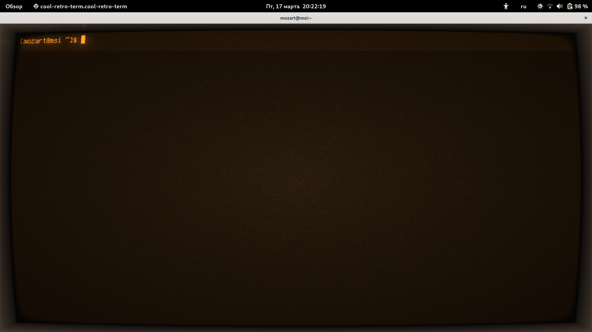
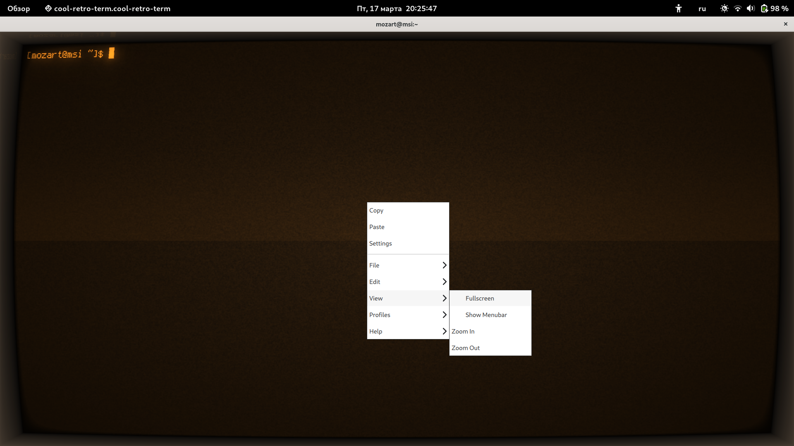
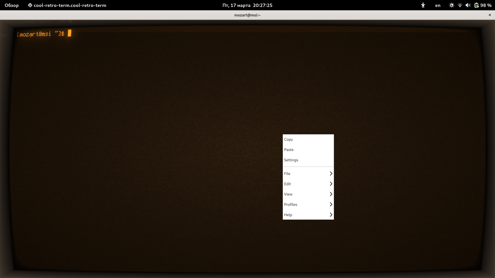
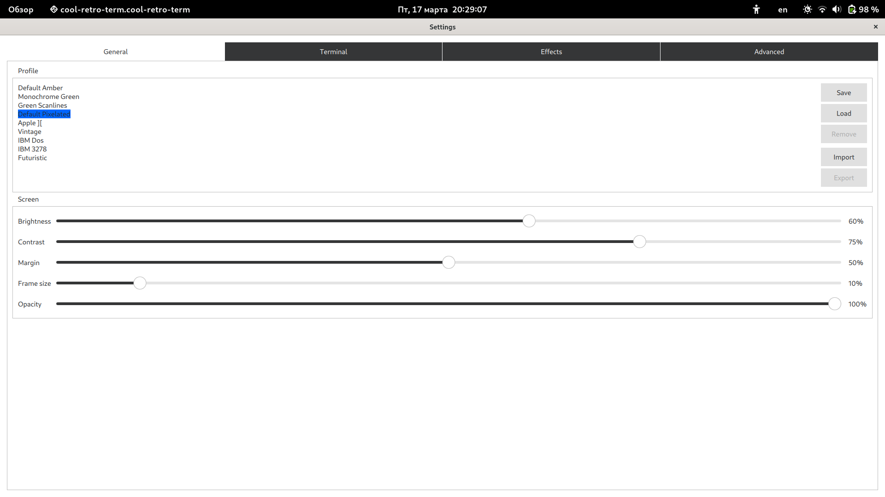
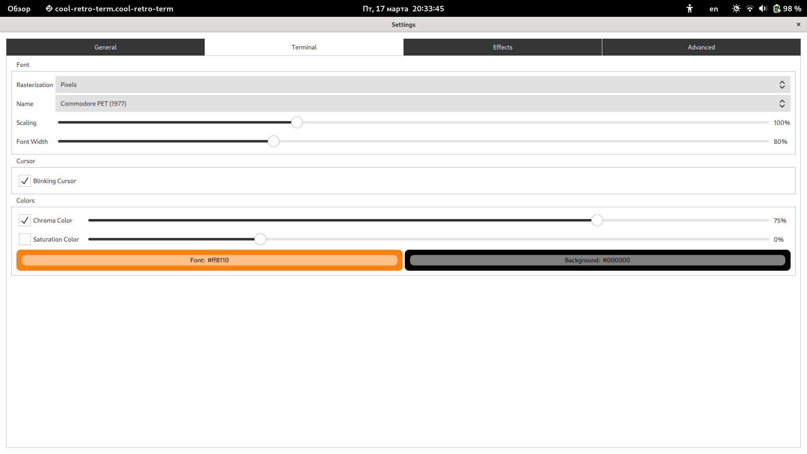
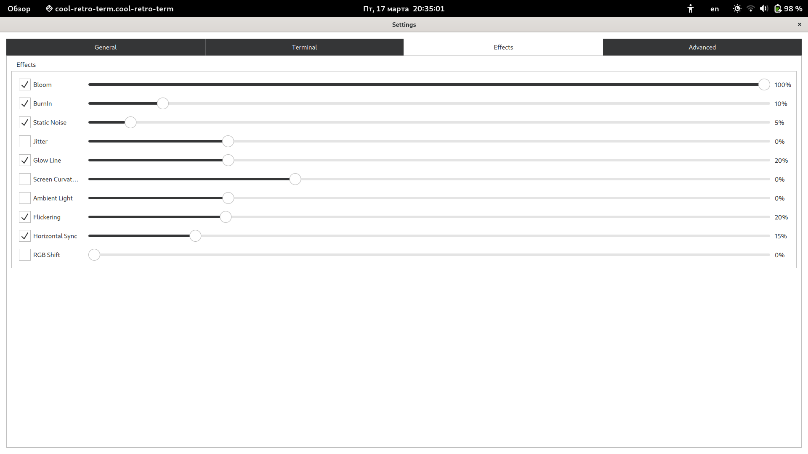
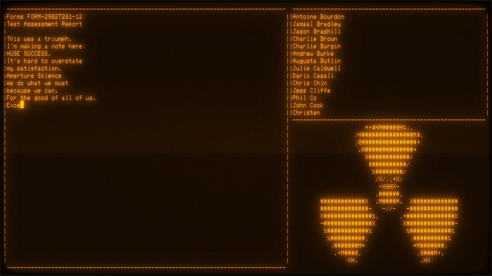

# Проект, который запускает песню "Still Alive" из Portal 1 с помощью Python внутри вашего terminal-а

## Зависимости
* Python 3
* Pip 3
* Terminal or Terminal Emulator(Windows-пользователи)
* Сool-retro-term

## Установка скрипта
* Клонировать репозиторий: `git clone https://github.com/LaggerIsME/Still_Alive_from_Portal_In_Linux_Terminal`
* Установить pip с помощью команды:
  * Ubuntu/Debian: `sudo apt install python3-pip`
  * Fedora: `sudo dnf install python3-pip`
  * Arch: `sudo pacman -S python-pip`
  * Остальные дистрибутивы: `ну, вы как-нибудь сами ребят...`
* Установить зависимость скрипта с помощью команды: `pip install playsound`

## Установка ретро-терминала
* Установить cool-retro-term с помощью команды:
  * Ubuntu/Debian: `sudo apt install cool-retro-term`
  * Fedora: `sudo dnf install cool-retro-term`
  * Arch: `sudo pacman -S cool-retro-term`
  * Остальные дистрибутивы: `ну, вы как-нибудь сами ребят...`

## Настройка ретро-терминала
### Откройте cool-retro-term через свой DE или пропишите в терминале: `cool-retro-term`

### Нажмите правой кнопкой мыши на приложение > View > FullScreen

### Нажмите правой кнопкой мыши на приложение > Settings

### Поставьте такие же настройки, как на скриншотах ниже 



### Закройте Settings и сделайте следующие действия:
* Перейдите в директорию со скриптом с помощью вашего ретро-терминала: `cd ~/Still_Alive_from_Portal_In_Linux_Terminal`
* Запустите скрипт с помощью команды: `python still_alive_credit.py`

## Параметры запуска

Запустить со звуком:

```
python3 still_alive_credit.py
```

Запустить без звука:

```
python3 still_alive_credit.py --no-sound
```

## Пример, как все выглядит в терминале



### Приятного вам наслаждения музыкой в терминале!
